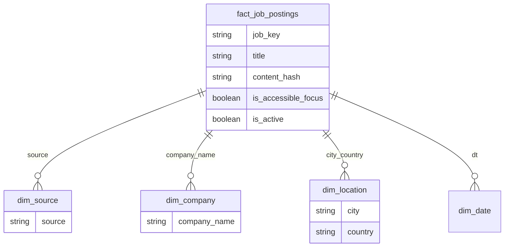

# Data model — warehouse & OLTP

## Medallion (data lake)

| Layer | Format | Purpose |
|-------|--------|---------|
| **Bronze** | JSONL per source/day | Raw extract, audit trail |
| **Silver** | Parquet | Cleansed, hashed, typed |
| **Gold** | Parquet | Deduped, Egypt-only, business-ready |

Path: `data/lake/jobs/{bronze|silver|gold}/...`

## Star schema (analytics / thesis)

Logical dimensional model produced in **Gold**:

`job_key` = `{source}:{external_id}`

## OLTP (MySQL — production app)

Gold loader writes to existing tables:

| Gold field | MySQL |
|------------|-------|
| title, description | `jobs` |
| company_name | `companies` (+ FK) |
| city, country | `locations` (+ FK) |
| requirements[] | `job_requirements` |
| is_accessible_focus | `jobs.is_accessible_focus` |
| disability_tags | `job_disability_support` (future mapping) |
| source, external_id | unique index |

## Audit

`import_runs` — one row per pipeline execution (added/updated/deactivated counts).

## Egypt filter

Applied in **Silver → Gold** using `config/egypt_filters.yaml`.

## Software / IT filter

Applied in connectors (pre-filter) and **Silver → Gold** using `config/software_filters.yaml`.
Only developer, engineer, DevOps, QA automation, etc. roles are kept.

## Accessible jobs

`is_accessible_focus` set when description/title matches disability-inclusive keywords.
